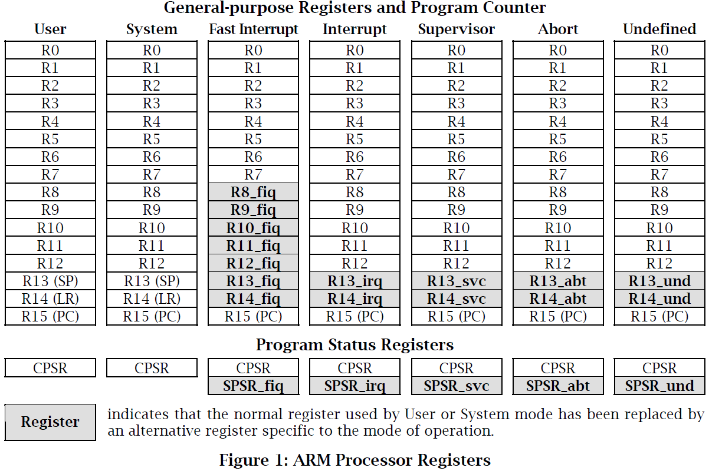
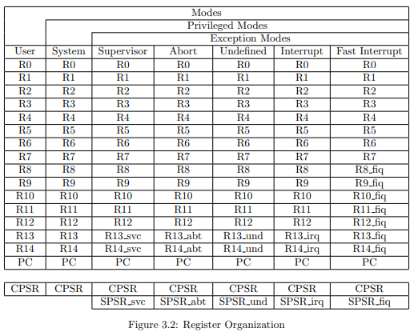
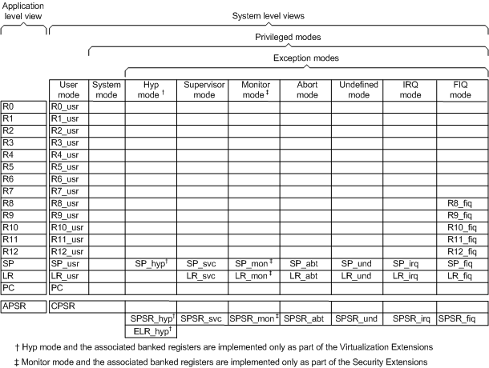
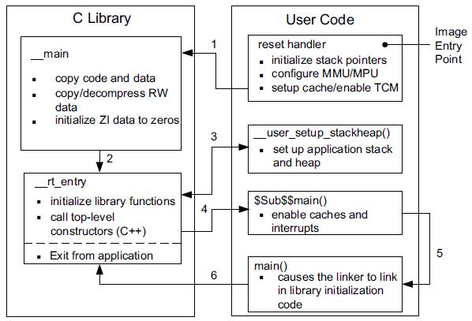
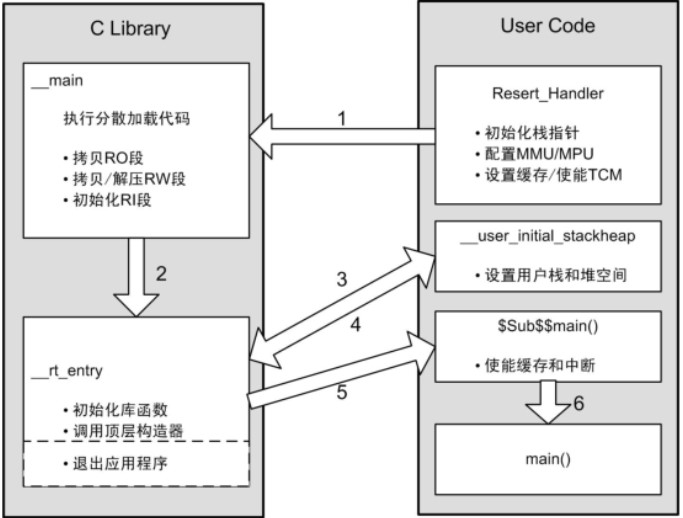

# ARM System Developer’s Guide
## ARM processor basics

The ARM processor has a simple privilege model. All modes are privileged apart from User mode. \
Privilege is the ability to perform certain tasks that cannot be done from User mode. \
For example, changing the operating mode is a privileged operation.

### Mode
The processor ***modes*** are:
- Thread Mode
    - 一般程式運行的狀態
    - Used to execute application software.
    - The processor enters Thread mode when it comes out of reset.
- Handler Mode
    - 處理exception的狀態
    - Used to handle exceptions.
    - The processor returns to Thread mode when it has finished all exception processing.  

### Privilege levels
The ***privilege levels*** for software execution are:
- Unprivileged
    - has limited access to the `MSR` and `MRS` instructions, and cannot use the `CPS` instruction
        - MSR and MRS, 用於在狀態暫存器(PSR, CPSR, SPSR)和通用暫存器(rn)之間傳送資料
        - [MSR][], ARM register to system coprocessor register
            - 寫 通用暫存器(General Purpose Register)的值到特殊功能暫存器(Special function register)
                - MSR <special_reg>, <gp_reg>
            - modify or restore CPRS from R0
                - MSR CPSR, R0
        - [MRS][], PSR to general-purpose register
            - 讀 特殊功能暫存器的值到 通用暫存器
                - MRS <gp_reg>, <special_reg>
            - save CPRS to R0
                - MRS R0, CPSR
    - cannot access the system timer, `NVIC`, or system control block
    - might have restricted access to memory or peripherals.
    - User mode is an unprivileged mode, and has restricted access to system resources. \
      All other modes have full access to system resources in the current security state, \
      can change mode freely, and execute software as privileged.
- Privileged
    - The software can use all the instructions and has access to all resources.
    - In this mode, software executes with unrestricted privileges. \
      In this mode of execution, the CPU allows software to access all hardware resources. \
      The entire Linux kernel executes in this mode.
------
Applications that require task protection usually execute in User mode. Some embedded \
applications might run entirely in any mode other than User mode. An application that \
requires full access to system resources usually executes in System mode.

| **Mode**             | **Privileged** | **Exception**  | **Purpose**                                                  |
| -------------------- | -------------- | -------------- | ------------------------------------------------------------ |
| User                 | No             | No             | Normal operating mode for most programs (tasks)              |
| System (SYS)         | Yes            | No             | Uses the same registers as User mode                         |
| Supervisor (SVC)     | Yes            | Yes            | Used when the processor is reset,  and to handle the software interrupt instruction **swi** |
| Abort (ABT)          | Yes            | Yes            | Used to handle memory access violations                      |
| Undefined (UND)      | Yes            | Yes            | Used to handle undefined or unimplemented instructions       |
| Interrupt (IRQ)      | Yes            | Yes            | Used to handle a low-priority (normal) interrupt             |
| Fast Interrupt (FIQ) | Yes            | Yes            | Used to handle a high-priority (fast) interrupt              |

- System mode is a privileged user mode for the operating system
    - You can only enter System mode from another privileged mode by modifying the mode bit of \
      the Current Program Status Register (CPSR).
- Supervisor Call, **SVC**
    - also known as Software Interrupt (SWI)
    - Used when the processor is **reset**, and to handle the software \
      interrupt instruction **swi**
- Monitor mode is available in some implementations to change between secure and non-secure states, and for debugging.
- Hypervisor mode is available in some implementations to control certain virtualization extensions.

### ARM Exception Types and Priorities
| Exception type        | Exception mode | Priority (1 = high, 6 = low) |
| --------------------- | -------------- | ---------------------------- |
| Reset                 | SVC            | 1                            |
| Undefined Instruction | UND            | 6                            |
| SWI                   | SVC            | 6                            |
| Prefetch Abort        | Abort          | 5                            |
| Data Abort            | Abort          | 2                            |
| Reserved              | Not applicable | Not applicable               |
| IRQ                   | IRQ            | 4                            |
| FIQ                   | FIQ            | 3                            |

------
### Registers
- r0 - r15
    - r13 sp, stack pointer
    - r14 lr, link register, return PC
    - r15 pc, program counter
    - cpsr, Current Processor Status Register
    - spsr, Saved Processor Status Register
        - Each privileged mode has its own PSR, however USR and SYS modes do not have an SPSR.

<!--  -->
<!--

-->

#### Reference
- [The ARM CPU](http://www.riscos.com/support/developers/asm/cpu.html)
- [The Status Register](https://heyrick.eu/armwiki/The_Status_register)
- [Operating Modes, System Calls and Interrupts](http://www.cs.otago.ac.nz/cosc440/readings/arm-syscall.pdf)
- [ARM Cortex-M3/4 權限切換](https://evshary.github.io/2018/12/02/ARM-CortexM3-4%E6%AC%8A%E9%99%90%E5%88%87%E6%8F%9B/)
- [ARM Exceptions](http://osnet.cs.nchu.edu.tw/powpoint/Embedded94_1/Chapter%207%20ARM%20Exceptions.pdf)

[MSR]: http://www.keil.com/support/man/docs/armasm/armasm_dom1361289881714.htm
[MRS]: http://www.keil.com/support/man/docs/armasm/armasm_dom1361289881054.htm

------
## Initializing the system

There are two initialization stages:

1. Initializing the execution environment, for example exception vectors,
   stacks, I/O.
1. Initializing the C library and application (C variables for example).

For a hosted application, the execution environment was initialized when the OS
starts (initialization is done by, for example, Angel, an RTOS, or ARMulator).
The application is then entered automatically through the `main()` function.
The C library code at `__main` initializes the application.

For an embedded application without an operating system, the code in ROM must
provide a way for the application to initialize itself and start executing.
No automatic initialization takes place on reset, so the application entry point
must perform some initialization before it can call any C code.

After reset, the instruction located at address `0x0`, must transfer control to
the initialization code. The initialization code must:

- set up exception vectors
- initialize the memory system
- initialize the stack pointer registers
- initialize any critical I/O devices
- change processor mode if necessary
- change processor state if necessary.

After the environment has been initialized, the sequence continues with the
application initialization and should enter the C code.

### Reset and Initialization sequence
#### ARM compiler
1. `Reset_handler`
1. `__main`
1. `__scatterload`
    - Initialize the Zero Initialized (ZI) regions to zero.
        - The ZI output section does not exist at load time. It is created at runtime.
    - Copy or decompress the non-root code and data region from their
      load-time locations to the execute-time regions. 
        - **Load view**
            - root region
                - `load address (LMA) == execution address (VMA)`
            - non-root region
                - `load address (LMA) != execution address (VMA)`
1. `__rt_entry`
    - Initialize the stack, heap and other C library sub systems.
        - `__user_setup_stackheap` or setup the Stack Pointer (SP) by another method
    - Call various initialization functions and then calls the user-level main().
1. `main`

<!--
-
-
-->
-
-

#### GCC compiler
1. `Reset_handler`
    - Initialize ZI(`.bss`)
    - Copy RW(`.data`), RO(`.txt`)
1. `__main`
1. `main`

### Reference
- [initializing the system](https://developer.arm.com/documentation/dui0056/d/writing-code-for-rom/initializing-the-system?lang=en)
- [STM32啟動](https://segmentfault.com/q/1010000004829859)
- [Cortex-M/R啟動流程](https://blog.csdn.net/ZCShouCSDN/article/details/89843714)
- [ARM Compiler C Library Startup and Initialization](https://static.docs.arm.com/dai0241/b/DAI0241B_startup_code_for_arm_compiler.pdf)
- [ARM Embedded C Tutorial : Compiling and linking your first embedded C Code](http://www.vlsiip.com/c/embedded_c/ec_0002.html)
- [ARM Sample Code, startup.s and initial serial](https://developer.arm.com/documentation/dui0056/d/writing-code-for-rom/loading-the-rom-image-at-address-0/sample-code?lang=en)
- [可重入Reentrant interrupt handlers](https://developer.arm.com/documentation/dui0056/d/handling-processor-exceptions/interrupt-handlers/reentrant-interrupt-handlers?lang=en)
