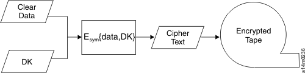
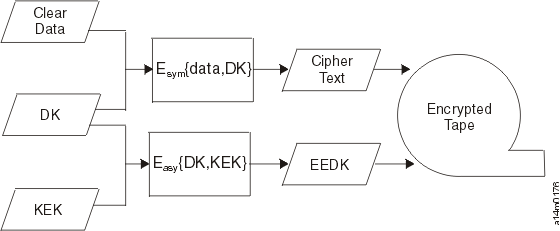
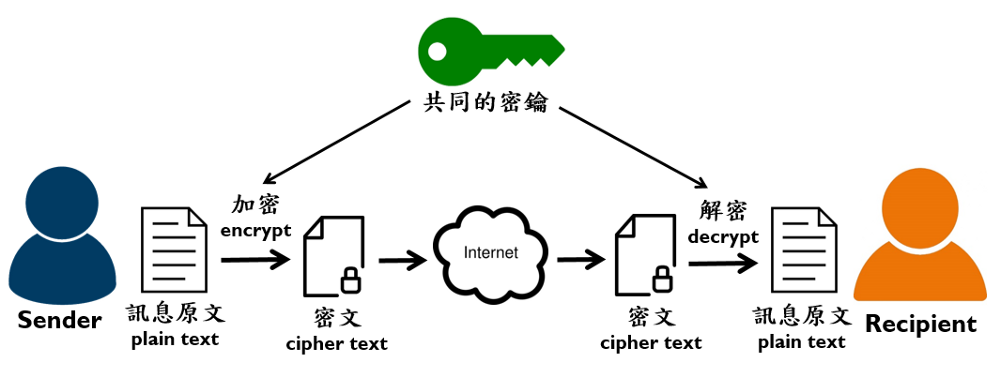
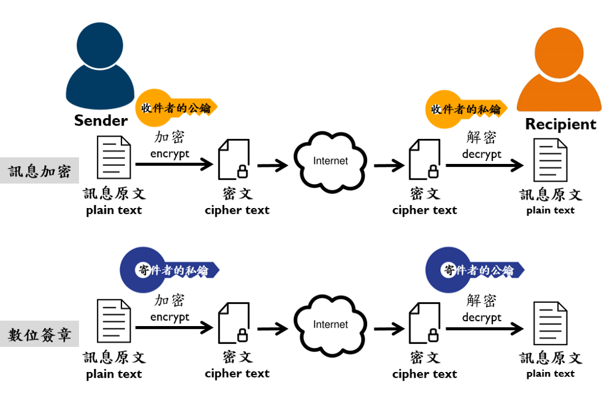
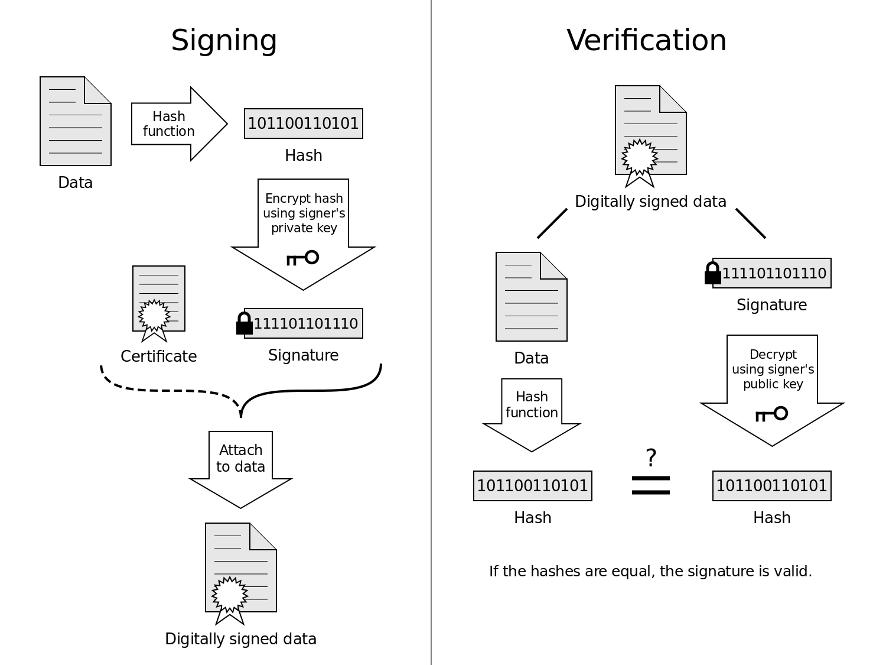
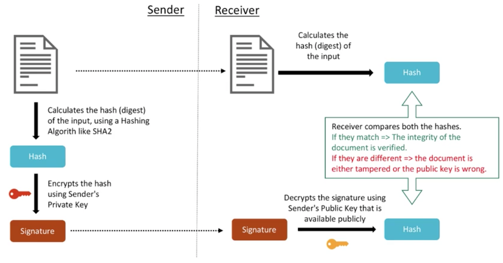
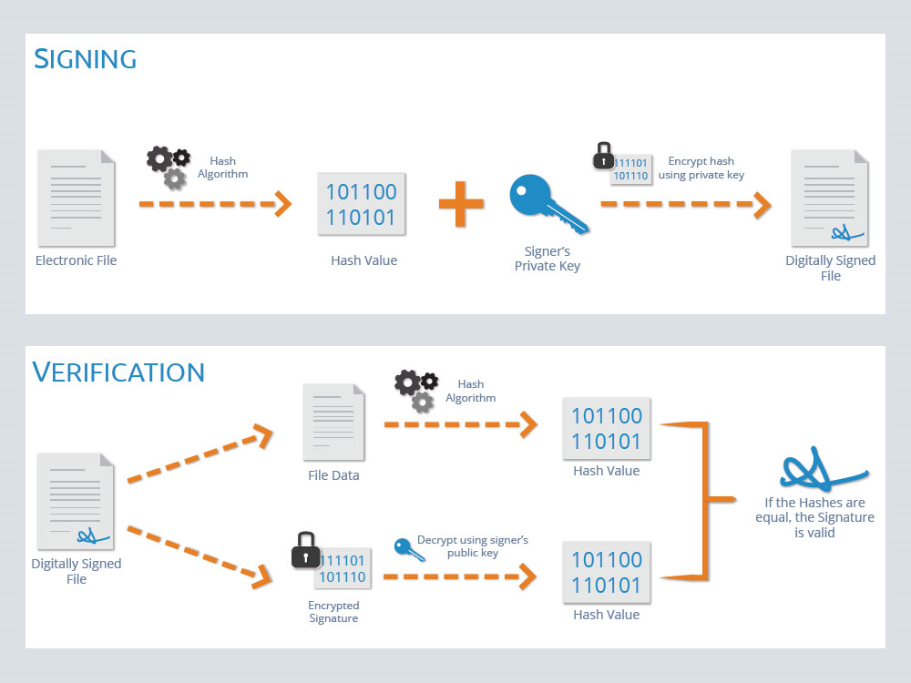
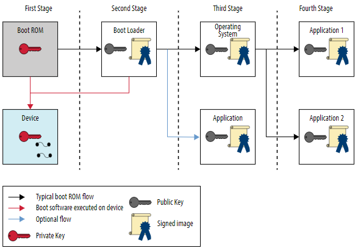
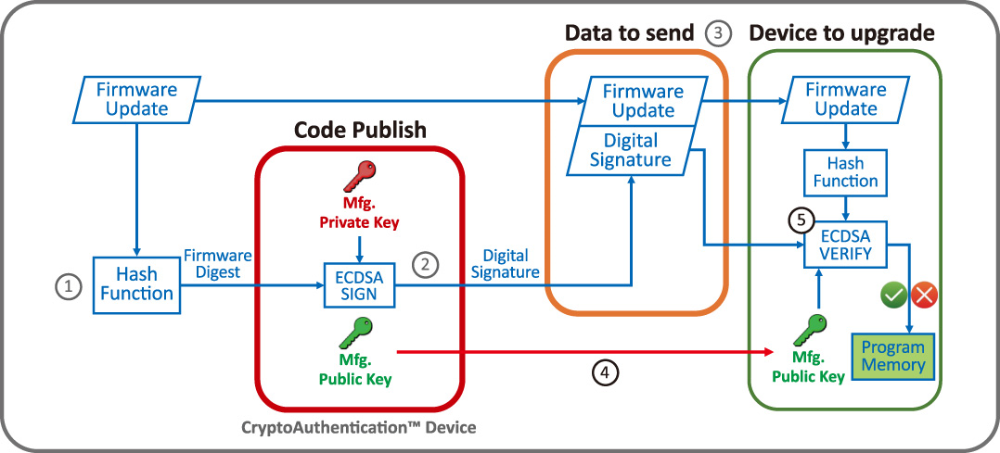
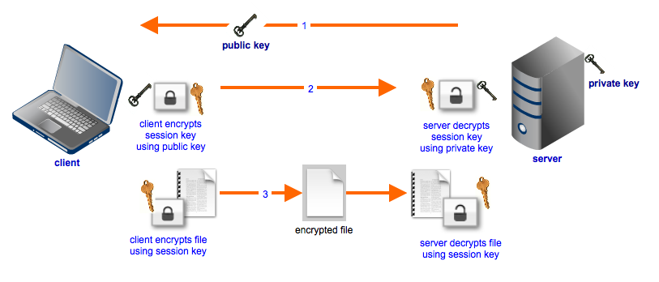

# Cryptography & Encryption
## 對稱加密 Symmetric Encryption
雙方使用的同一個金鑰，既可以加密又可以解密，這種加密方法稱為對稱加密，也稱為單金鑰加密。
在對稱加密演算法中常用的演算法有：DES、AES等。

- 優點：速度快，對稱性加密通常在訊息傳送方需要加密大量資料時使用，演算法公開、計算量小、加密速度快、加密效率高。
- 缺點：在資料傳送前，傳送方和接收方必須商定好祕鑰，然後 使雙方都能儲存好祕鑰。其次如果一方的祕鑰被洩露，那麼加密資訊也就不安全了。另外，每對使用者每次使用對稱加密演算法時，都需要使用其他人不知道的唯一祕鑰，這會使得收、發雙方所擁有的鑰匙數量巨大，金鑰管理成為雙方的負擔。

**AES**<br>
進階加密標準(Advanced Encryption Standard)，在密碼學中又稱Rijndael加密法，是美國聯邦政府採用的一種區塊加密標準。
嚴格地說，AES和Rijndael加密法並不完全一樣(雖然在實際應用中兩者可以互換)，因為Rijndael加密法可以支援更大範圍的區塊和金鑰長度;
AES的區塊長度固定為128位元，金鑰長度則可以是128，192或256位元


## 非對稱加密 Asymmetric Encryption
[公開金鑰密碼學](https://zh.wikipedia.org/zh-tw/%E5%85%AC%E5%BC%80%E5%AF%86%E9%92%A5%E5%8A%A0%E5%AF%86)
Public-key cryptography 也稱非對稱式密碼學是密碼學的一種演算法

它需要兩個金鑰，一個是公開密鑰，另一個是私有密鑰；公鑰用作加密，私鑰則用作解密。使用公鑰把明文加密後所得的密文，只能用相對應的私鑰才能解密並得到原本的明文，最初用來加密的公鑰不能用作解密。由於加密和解密需要兩個不同的密鑰，故被稱為非對稱加密；不同於加密和解密都使用同一個密鑰的對稱加密。公鑰可以公開，可任意向外發布；私鑰不可以公開，必須由用戶自行嚴格秘密保管，絕不透過任何途徑向任何人提供，也不會透露給被信任的要通訊的另一方。

基於公開密鑰加密的特性，它還能提供數位簽章的功能，使電子檔案可以得到如同在紙本檔案上親筆簽署的效果。

### 數位簽章
相反，**如果某一用戶使用他的私鑰加密明文，任何人都可以用該用戶的公鑰解密密文**；由於私鑰只由該用戶自己持有，故可以肯定該檔案必定出自於該用戶；公眾可以驗證該用戶發布的資料或檔案是否完整、中途有否曾被篡改，接收者可信賴這些資料、檔案確實來自於該用戶，這被稱作數位簽章

在非對稱加密演算法中常用的演算法有： RSA、DSA、ECC
- 優點：安全
- 缺點：速度較慢

**RSA**<br>
由RSA公司發明，是一個支持變長密鑰的公共密鑰算法，需要加密的文件塊的長度也是可變的。RSA在國外早已進入實用階段，已研製出多種高速的RSA的專用晶片。

這是以1977年由Ron Rivest, Adi Shamir and Leonard Adleman 公開說明的演算法, 因此以三人姓名命名.
若使用者A, 需要傳送加密訊息給使用者B, 則步驟如下: (以下簽章訊息並非必要步驟, 可省略)
1. 建立金鑰: AB雙方各自產生一組成對的(公鑰及私鑰).<br>
   公鑰作為加密用途, 須對外公開;<br>
   私鑰作為解密用途, 不對外公開, 必須嚴格保管, 確認授權後才能使用.
1. 取得公鑰: A取得(B的公鑰), 並確保(B的公鑰)是來自於B.<br>
   公鑰應公開給任何人, 才能方便的接收來自任何人的加密訊息.<br>
   公鑰通常會存放在可信賴的第三方憑證組織 CA Server 上, 公開給任何人取得, 可確保公鑰是來自於B. 例如: VISA 組織.<br>
   公鑰的信賴方式:
    1. 經由可信賴的第三方憑證組織的信賴程度.
    2. 透過與B約定確認後的方法.
1. 加密原文
    - A利用(B的公鑰), 加密(原文)後, 產生(加密訊息).
1. 製作簽章
    - A利用(A的私鑰), 簽章(原文)後, 產生(簽章訊息).
1. 傳送訊息
    - B取得(A的公鑰), (加密訊息), (簽章訊息).
1. 解密訊息
    - B利用(B的私鑰), 解密(加密訊息), 取得(原文).
1. 驗證簽章
    - B取得(A的公鑰), 驗證(簽章訊息), 確定(加密訊息)沒有被竄改.

- 參考數據:<br>
以 RSACryptoServiceProvider, PKCS #1 V 1.5 padding 實作, 若KeySize=1024 bits, 則可加密 117 bytes, 若KeySize = 2048 bits, 則可加密 245 bytes.


**DSA (Digital Signature Algorithm)**<br>
數字簽名算法，是一種標準的 DSS(數字簽名標準)，嚴格來說不算加密算法。

**ECC (Elliptic Curves Cryptography)**<br>
橢圓曲線密碼編碼學。ECC和RSA相比，具有多方面的絕對優勢，主要有：抗攻擊性強。相同的密鑰長度，其抗攻擊性要強很多倍。
計算量小，處理速度快。ECC總的速度比RSA、DSA要快得多。存儲空間占用小。ECC的密鑰尺寸和系統參數與RSA、DSA相比要小得多，意味著它所占的存貯空間要小得多。這對於加密算法在IC卡上的應用具有特別重要的意義。帶寬要求低。
當對長消息進行加解密時，三類密碼系統有相同的帶寬要求，但應用於短消息時ECC帶寬要求卻低得多。帶寬要求低使ECC在無線網絡領域具有廣泛的應用前景。<br>比RSA更快、更有效率的加密演算法，密鑰長度建議160Bytes.

---

## 安全散列算法 SHA (Secure Hash Algorithm)
散列算法，又稱哈希函數，是一種單向加密算法。在信息安全技術中，經常需要驗證消息的完整性，散列(Hash)函數提供了這一服務，它對不同長度的輸入消息，產生固定長度的輸出。
這個固定長度的輸出稱為原輸入消息的"散列"或"消息摘要"(Message digest)。散列算法不算加密算法，因為其結果是不可逆的，既然是不可逆的，那麼當然不是用來加密的，而是簽名。

用途: 主要用於驗證，防止信息被修。具體用途如：文件校驗、數字簽名、鑒權協議

安全雜湊演算法主要有兩個特性:

1. 是不論檔案的大小為何，都可以得到固定長度的字串，也就是說輸出長度並不受輸入長度影響。這種轉換是一種壓縮映射， 因為輸出長度通常都遠遠小於輸入長度。
1. 是由字串(也就是雜湊值)反推出原始檔案是非常困難的，因為可以確保檔案的安全性，這種特性被稱為單向雜湊，也是此演算法為何稱作"安全"的意思。

SHA是由美國國家安全局制定，主要應用於數字簽名標準裡面的數字簽名算法(DSA: Digital Signature Algorithm)，SHA家族中以SHA1和SHA256最為廣泛使用。
SHA1的雜湊值長度為160bit、SHA256則為256bit，長度越長碰撞的機會就越低也越安全，但同時計算的時間複雜度也隨著增高。

在過去許多網站的安全性憑證都是透過SHA1來驗證，但隨著科技提升SHA1的缺點越來越顯著且安全性也被質疑，在2017年時SHA1已經被Google破解證實是不安全的算法。

現在SHA256成為了新的標準，許多憑證或是前陣子很紅的加密貨幣都是採用較為安全的SHA256。雖然SHA256的安全性也是被許多人質疑，但目前還沒有出現對SHA256有效的攻擊。

散列算法(簽名算法)<br>
- MD5
- SHA-1 1995年發佈
- SHA-2 2001年發佈
    - SHA-224、SHA-256、SHA-384、SHA-512、SHA-512/224、SHA-512/256
- SHA-3 2015年發佈
    - SHA-3並不是要取代SHA-2，因為SHA-2目前並沒有出現明顯的弱點。由於對MD5出現成功的破解，以及對SHA-0和SHA-1出現理論上破解的方法，NIST感覺需要一個與之前演算法不同的，可替換的加密雜湊演算法，也就是現在的SHA-3.

**MD5**<br>
MD5是一種不可逆的加密算法，目前是最牢靠的加密算法之一，尚沒有能夠逆運算的程序被開發出來，它對應任何字符串都可以加密成一段唯一的固定長度的代碼。

**SHA1**<br>
是由NISTNSA設計為同DSA一起使用的，它對長度小於264的輸入，產生長度為160bit的散列值，因此抗窮舉(brute-force)性更好。SHA-1設計時基於和MD4相同原理,並且模仿了該算法。SHA-1是由美國標準技術局(NIST)頒布的國家標準，是一種應用最為廣泛的Hash函數算法，也是目前最先進的加密技術，被政府部門和私營業主用來處理敏感的信息。而SHA-1基於MD5，MD5又基於MD4。

**HMAC**<br>
是密鑰相關的哈希運算消息認證碼(Hash-based Message Authentication Code), HMAC運算利用哈希算法，以一個密鑰和一個消息為輸入，生成一個消息摘要作為輸出。也就是說HMAC是需要一個密鑰的。所以，HMAC_SHA1也是需要一個密鑰的，而SHA1不需要。

---

### Reference
- [對稱加密 vs 非對稱加密](https://academy.binance.com/zt/security/symmetric-vs-asymmetric-encryption)
- [加密方法比較表](http://svc.011.idv.tw/ShareAll/KM/What/%E5%8A%A0%E5%AF%86%E6%96%B9%E6%B3%95%E6%AF%94%E8%BC%83%E8%A1%A8.html)
- [加密算法比較和應用](https://kknews.cc/zh-tw/code/kbqp4bb.html)
- [SHA1/SHA256 Performance Evaluation](https://medium.com/renee0918/sha1-sha256-performance-evaluation-cf70862a9d7c)

---
### IBM - [About encryption keys](https://www.ibm.com/support/knowledgecenter/en/STPRH6/com.ibm.storage.drives.doc/top_tscom_reuse_encryptoview_keys.html)

An encryption key is typically a random string of bits generated specifically to scramble and unscramble data. Encryption keys are created with algorithms designed to ensure that each key is unique and unpredictable. The longer the key constructed this way, the harder it is to break the encryption code. Both the IBM and T10 methods of encryption use 256-bit AES algorithm keys to encrypt data. 256-bit AES is the encryption standard that is recognized and recommended by the US government, which allows three different key lengths. 256-bit keys are the longest allowed by AES.

**Two types of encryption algorithms** can be used by the encryption key server: **symmetric algorithms and asymmetric algorithms.** **`Symmetric, or secret key encryption, uses a single key for both encryption and decryption.`** Symmetric key encryption is used for encrypting large amounts of data efficiently. 256-bit AES keys are symmetric keys.

**`Asymmetric, or public/private encryption, uses a pair of keys.`** Data encrypted with one key are decrypted only with the other key in the public/private key pair. When an asymmetric key pair is generated, the public key is typically used to encrypt, and the private key is typically used to decrypt.

The encryption key server uses both symmetric and asymmetric keys; symmetric encryption for high-speed encryption of user or host data, and asymmetric encryption (which is necessarily slower) for protecting the symmetric key.

keyword table
- unencrypted data (clear text)
- converted to ciphertext with a symmetric 256-bit AES Data Key (DK)
- an asymmetric Key Encrypting Key (KEK)
- an Externally Encrypted Data Key (EEDK)


#### Encryption with only symmetric encryption keys


<br>

#### Encryption with both symmetric and asymmetric encryption keys


---
### [基礎密碼學(對稱式與非對稱式加密技術)](https://medium.com/@RiverChan/%E5%9F%BA%E7%A4%8E%E5%AF%86%E7%A2%BC%E5%AD%B8-%E5%B0%8D%E7%A8%B1%E5%BC%8F%E8%88%87%E9%9D%9E%E5%B0%8D%E7%A8%B1%E5%BC%8F%E5%8A%A0%E5%AF%86%E6%8A%80%E8%A1%93-de25fd5fa537)

#### 對稱式加密運作原理

#### 非對稱式加密運作原理


### [數位簽章 Digital Signature](https://zh.wikipedia.org/zh-tw/%E6%95%B8%E4%BD%8D%E7%B0%BD%E7%AB%A0)
又稱公鑰數位簽章通常我們使用公鑰加密，用私鑰解密。而在數位簽章中，我們使用私鑰加密(相當於生成簽名)，公鑰解密(相當於驗證簽名)。

#### 數字簽名和驗證過程


<br>

#### 數位簽章


<br>

#### Digital Signatures Methodology


---

### [Intel Arria 10 SoC Secure Boot User Guide](https://www.intel.com/content/www/us/en/programmable/documentation/cru1452898171006.html)


---

### [非對稱式 Security Boot/Security Update](http://www.hope.com.tw/DispArt/tw/1906251409D7.shtml)的實作 - CTIMES

Security Boot是一種用於確保系統內運作的應用程式碼被授權的方法，通常由設計與構建系統的廠商提供。通過確保應用程式碼為正確的授權版本可以防止不可預測的系統程式造成機器性能異常、安全性受損甚至財產損失。大多數電子系統使用可編程非揮發性存儲器 (Flash) 存放其應用程式碼 (Application Code)，無論大小都可以利用Security Boot保護該程式碼不被惡意竄改。本文說明Security Boot的基本觀念，同時深入地介紹其處理方式並提供解決方案。

#### Security Update流程

前置作業：下圖紅色方框所代表的角色為程式碼簽發者(Code Publish)，其包含一組唯一的公鑰(Public Key)和私鑰(Private Key)



1. 要進行升級的應用程式(Firmware update)應該要先透過Hash Function(例如SHA256)獲取其Digest (此步驟就如同用XOR計算出程式碼的Checksum，只是SHA256 Digest為256-bit遠大於Checksum，具有絕對唯一性)。

1. 接著程式碼的簽發機構(Code Publish)需要針對該程式碼的Digest透過其私鑰進行“加密” (ECDSA SIGN)，加密過後的資料我們稱作數位簽章(Digital Signature)。因為擁有該私鑰即擁有權力簽發正式版本程式碼的數位簽章，故一般而言私鑰將會被存放於硬體保護的晶片裡(如ATECC608A)，避免對外流傳。

1. 將更新應用程式與數位簽章(Data to Send)透過有線或是無線的方式傳送至待更新的裝置(Device to Upgrade)。進行更新之前，待更新裝置必須驗證此應用程式與數位簽章的正確性。

1. 在非對稱的算法中，每個存在的私鑰會有一個相對的公鑰存在，其私鑰用來“加密”(ECDSA SIGN)，公鑰則用來“解密” (ECDSA VERIFY)，故更新裝置中應該要預先配備相對的公鑰。為了能限制僅搭配特定的程式碼簽發機構(Code Publish)作“解密”，其公鑰必須存放在一次性燒錄的記憶體中(OTP)，避免被更換為駭客私鑰的對應公鑰。

1. 更新裝置(Device to Upgrade)在收到更新程式(Firmware update)後即先透過Hash function(例如SHA256)獲取其Digest(如同第1步驟)，為確認該Digest是否正確，必須透過公鑰對同步收到的數位簽章作解密並判斷是否符合更新程式的Digest (ECDSA VERIFY)。若是符合，則該更新程式允以更新該裝置。反之，假設該更新程式並非官方發行程式碼(沒有透過Code Publish簽發數位簽章)，經過第5步驟的驗證，因為其計算出來的Digest將不同於透過公鑰所解密的數位簽章，該程式碼則不予運作。

#### Security Boot流程
如同Security Update流程第5步驟，開機後即先透過Hash Function(例如SHA256)計算應用程式之Digest，接著確認該Digest是否正確：透過公鑰對數位簽章作解密並判斷是否符合該應用程式的Digest (ECDSA VERIFY)。

##### 運行Security Update之裝置需求

1. 一次性燒錄的記憶體<br>
為了能夠完成Security Update/Security Boot流程，其中步驟4提到裝置必須預先配備公鑰於一次性燒錄的記憶體中(OTP)，目前市售MCU提供OTP功能的並不多，或者價錢相對不便宜。

1. 進行ECDSA VERIFY運算<br>
步驟5中提到需要對應用程式Digest與程式碼數位簽章利用OTP區的公鑰進行ECDSA VERIFY運算。該運算量相當龐大，如下圖若以Cortex®-M0+進行運算將耗費5秒。開機若需要耗費如此多的時間將不容易被使用者接受。

---

[Hybrid cryptosystem](https://en.wikipedia.org/wiki/Hybrid_cryptosystem) 混合加密系統<br>
在許多應用中，對稱和非對稱加密會一起使用。 這種混合系統的典型案例是安全套接字層（SSL）和傳輸層安全（TLS）加密協議，該協議被用於在因特網內提供安全通信。 SSL協議現在被認為是不安全的，應該停止使用。 相比之下，TLS協議目前被認為是安全的，並且已被主流的Web瀏覽器所廣泛使用。

[Session key](https://zh.wikipedia.org/zh-tw/%E5%B0%8D%E8%A9%B1%E9%8D%B5) 中文常稱作對話鍵、會議金鑰、對談金鑰、對話金鑰或是會話密鑰，是一次性用於對談中加密用的對稱式金鑰，所有成員使用同一把金鑰來加密明文、解密密文[2]，在此次連線結束該金鑰即無效，如需重新通訊則需要再重新進行一次金鑰的產生及交換等步驟。

常見的相關用語有：
- 內容加密金鑰(content encryption key，CEK)
- 流量加密金鑰(traffic encryption key，TEK)
- 加密金鑰的多播密鑰(multicast key)
- 密鑰加密密鑰(key encryption key，KEK)或鑰匙包裝鑰匙(key wrapping key)
- session key 僅指對稱式加密中的對稱金鑰，如果是非對稱式加密則有公開金鑰(public key)、私密金鑰(private key)之分。

[Getting the best of both worlds with hybrid cryptosystems](https://www.jscape.com/blog/bid/84422/Symmetric-vs-Asymmetric-Encryption)<br>
Here's a simplified outline of the steps taken by a typical hybrid cryptosystem used in secure file transfer protocols like SFTP and FTPS.

1. File transfer server sends its public key to an end user's file transfer client.

1. Client generates a session key, encrypts a copy of the session key using the public key, and sends that copy to the server.

1. Server receives its copy of the session key and both of them use that session key to encrypt/decrypt files exchanged within that session.



---

### OpenSSL example
```bash
openssl rsautl -help

# Generate a 2048 bit RSA Key
openssl genrsa -out rsa.private

# Export the RSA Public Key to a File
openssl rsa -in rsa.private -out rsa.public -pubout -outform PEM

# Encrypt with public key and decrypt with private key
openssl rsautl -encrypt -inkey rsa.public -pubin -in foo -out foo.encrypt
openssl rsautl -decrypt -inkey rsa.private -in foo.encrypt -out foo.decrypt

# Encrypt with private key and decrypt with public key
openssl rsautl -sign -inkey rsa.private -in foo -out foo.encrypt
openssl rsautl -verify -inkey rsa.public -pubin -in foo.encrypt -out foo.decrypt
```
---
